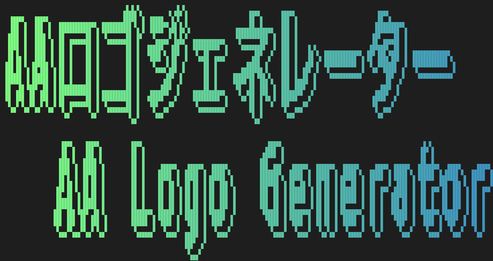

# AA Logo Generator Type Yuzuko (ユズコ式AAロゴジェネレーター)



A professional-grade ASCII Art logo generator that supports multi-language fonts and advanced styling.

---

## Index / 目次

* [English Description](#english-description)
* [日本語説明はこちら](#日本語説明はこちら)
* [How to Run / 実行方法](#how-to-run--実行方法)
* [Installation / インストール](#installation--インストール)

---

## English Description

### Features

* **Multi-Language Support**: Works with any font (TTF/OTF) installed on your system.
* **Advanced Styling**: Gradient coloring, Shadows (Outline Offset), and Character/Line Spacing control.
* **Multi-Platform**: Compatible with Windows, macOS, and Linux.
* **Export Options**: Copy as colored ANSI text for terminals or save as a high-quality PNG image.

---

## 日本語説明はこちら

### 特徴

* **全言語・全フォント対応**: システムにインストールされている全てのフォント（TTF/OTF）を利用可能です。
* **高度なスタイリング**: グラデーションカラー、シャドウ（枠線ずらし）、文字間隔・行間の微調整が可能です。
* **マルチプラットフォーム**: Windows, macOS, Linux で動作します。
* **書き出し機能**: ターミナル用の色付きANSIテキストのコピーや、高画質なPNG画像としての保存に対応しています。

---

## How to Run / 実行方法

You can run the application in two ways:
どちらの方法でもアプリを実行できます：

1. **Executable**: Run `ユズコ式AAジェネレーター.exe` directly (Windows only).
   (Windowsユーザーは、`ユズコ式AAジェネレーター.exe` を直接ダブルクリックして実行できます。)
2. **Python Script**: Run `main.py` using your Python environment.
   (開発環境がある場合は、Pythonから `main.py` を実行することも可能です。)

---

## Installation / インストール

### For Developers (Python Setup)

1. Clone this repository.
2. Install dependencies:
   ```bash
   pip install Pillow customtkinter pyperclip
   ```
## Build / ビルド (Windows)
```bash
pyinstaller --onefile --windowed --icon="assets/icon.ico" --name="ユズコ式AAジェネレーター" main.py
```
